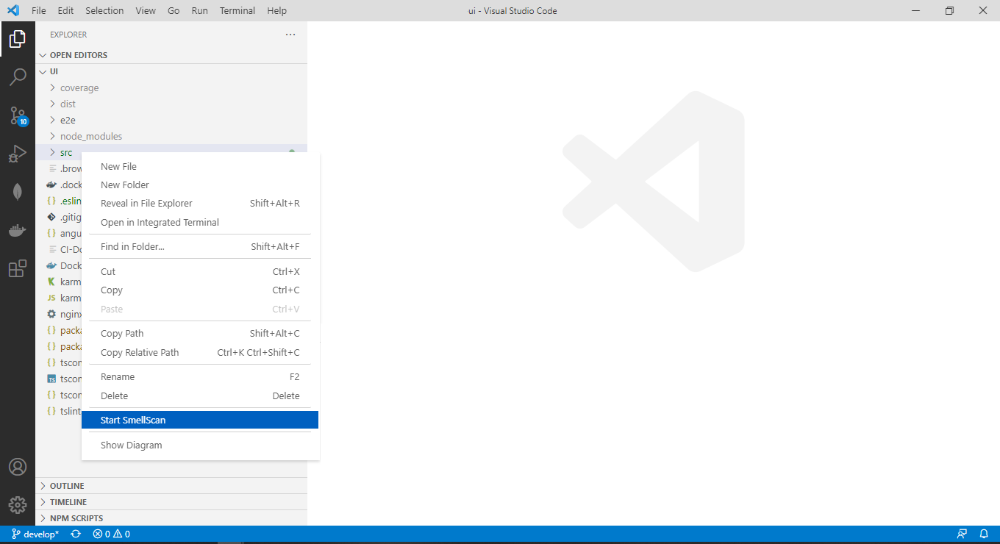

# SmellScan-ts

SmellScan-ts scans the Angular/TypeScript code for detecting design smells or violations of design principals. The Angular/TypeScript code must follow OOP approach to find smells.

Install VS Code extension from here: https://marketplace.visualstudio.com/items?itemName=abhipsb.smellscan-ts

## Features
Detects following 10 smells from the typescript code:
- [Imperative Abstraction](https://www.tusharma.in/smells/IA.html)
- [Unnecessary Abstraction](https://www.tusharma.in/smells/UA.html)
- [Deficient Encapsulation](https://www.tusharma.in/smells/DE.html)
- [Broken Hierarchy](https://www.tusharma.in/smells/BH.html)
- [Cyclic Hierarchy](https://www.tusharma.in/smells/CH.html)
- [Deep Hierarchy](https://www.tusharma.in/smells/DH.html)
- [Multipath Hierarchy](https://www.tusharma.in/smells/MH2.html)
- [Rebellious Hierarchy](https://www.tusharma.in/smells/RH.html)
- [Wide Hierarchy](https://www.tusharma.in/smells/WH.html)
- [Broken Modularization](https://www.tusharma.in/smells/BM.html)

## How to use

- Select and Right click the folder in the EXPLORER on which you want to run the tool
- Click on the 'Start SmellScan' menu option in context menu
- A file named designSmells.csv will be generated with the report

## Issue reporting
- https://github.com/abhipsb/smellscan-ts

## VS Code version supported
- V 1.56.0 or later

## Details and references
- It's based on DesigniteJava https://www.designite-tools.com/designitejava/
- The code is re-written from scratch in TypeScript for scanning the TypeScript code.
- Refer http://www.designsmells.com/ to know more about design smells.
